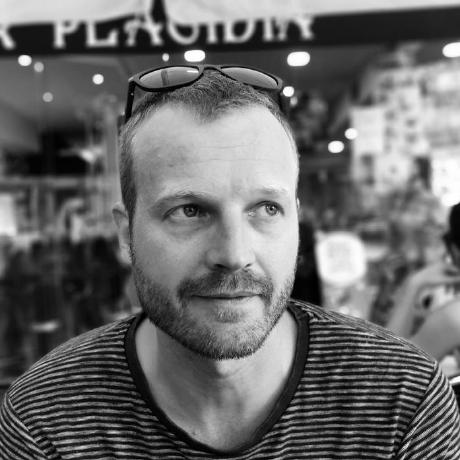

::: {.hero}
::: {.hero-photo}

:::

::: {.hero-text}
# Hi, I'm Jordi 👋

::: {.hero-tagline}
Senior Data Engineer, Barcelona
:::

I like building data platforms that are reliable and easy to reason about — from data modeling to governance and production ELT pipelines. Alongside that, I've always kept a foot in data science and, more recently, applied AI. 5+ years in data engineering, 15+ years building things with data across energy and tech.

::: {.pill-row}
[Python]{.pill} [SQL]{.pill} [AWS]{.pill} [dbt]{.pill} [Airflow]{.pill} [PySpark / Polars]{.pill} [LLMs / GenAI]{.pill}
:::
:::
:::

::: {.stats-row}
::: {.stat-card}
[5+]{.stat-number}
[years as a data engineer]{.stat-label}
:::
::: {.stat-card}
[10+]{.stat-number}
[teams using tools I built]{.stat-label}
:::
::: {.stat-card}
[50]{.stat-number}
[production Airflow pipelines]{.stat-label}
:::
::: {.stat-card}
[17+]{.stat-number}
[LLM prompts running in production]{.stat-label}
:::
:::

[What I like working on]{.section-eyebrow}

## A few things I enjoy building

::: {.feature-grid}
::: {.feature-card style="--accent-color: var(--accent-1);"}
[🏗️]{.feature-icon}

### Data lake architecture

Data models and lake architectures on AWS (S3, Glue, Athena, Lambda, ECS, RDS), including entity-level historical tracking of change over time.
:::

::: {.feature-card style="--accent-color: var(--accent-2);"}
[⚙️]{.feature-icon}

### Production ELT pipelines

Pipelines with dbt, Airflow, PySpark and Polars, aimed at holding up reliably at GB-scale rather than just working once.
:::

::: {.feature-card style="--accent-color: var(--accent-3);"}
[🤖]{.feature-icon}

### LLM-powered enrichment

Structured pipelines using OpenAI/Anthropic APIs for translation, entity matching and classification — with retries, caching and provider abstraction.
:::

::: {.feature-card style="--accent-color: var(--accent-4);"}
[📈]{.feature-icon}

### Data science & forecasting

Multi-model forecasting (XGBoost, Random Forest, Time Fusion Transformer) building on physics-based models from my energy-engineering background — where my data journey started.
:::
:::

[Explore]{.section-eyebrow}

## Where to go next

::: {.cta-row}
[About me →](about.qmd){.cta-btn .cta-primary}
[Projects →](projects.qmd){.cta-btn .cta-secondary}
[Blog →](blog.qmd){.cta-btn .cta-secondary}
:::

A background in physics and energy engineering shaped how I work: understand the system first, question assumptions, and let the data guide the decision. Outside of production work, I build small end-to-end projects — a from-scratch Iceberg lakehouse, dbt on real open weather data, a PyTorch mushroom classifier — to learn technologies hands-on before they show up at work. See [Projects](projects.qmd) for details.
