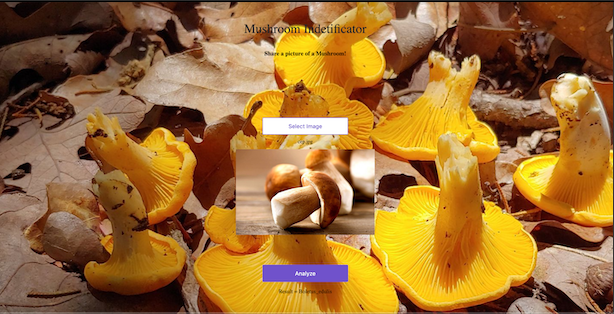

A selection of personal projects — mostly built to learn a technology hands-on before using it in production.

## iceduck

**A from-scratch data lakehouse, built for learning.**

dbt-duckdb + Apache Iceberg on an AWS Glue Data Catalog, emulated locally with Floci and provisioned with OpenTofu. Covers the pieces that don't show up in a tutorial: catalog integration, local AWS emulation, and infrastructure-as-code around the lakehouse itself, not just the transformations.

`dbt` · `iceberg` · `aws-glue` · `lakehouse` · `duckdb` · `opentofu`

[View on GitHub →](https://github.com/maurice1979/iceduck)

---

## xema-dbt

**Real open data, transformed with dbt.**

XEMA automatic weather station data from Catalonia's Open Data portal, modeled with dbt on DuckDB. A smaller, earlier step than iceduck — dbt fundamentals applied to a real (if modest) dataset rather than a toy example.

`dbt` · `duckdb` · `open-data`

[View on GitHub →](https://github.com/maurice1979/xema-dbt)

---

## Mushroom Identifier

{fig-alt="Screenshot of the Mushroom Identifier web app" width="60%"}

**Mushroom image classification, end to end.**

A web app that classifies mushroom species from a photo, built on PyTorch and deployed as a small full-stack app rather than left as a notebook.

`pytorch` · `deep-learning` · `computer-vision`

[View on GitHub →](https://github.com/maurice1979/mushroom-identifier)
